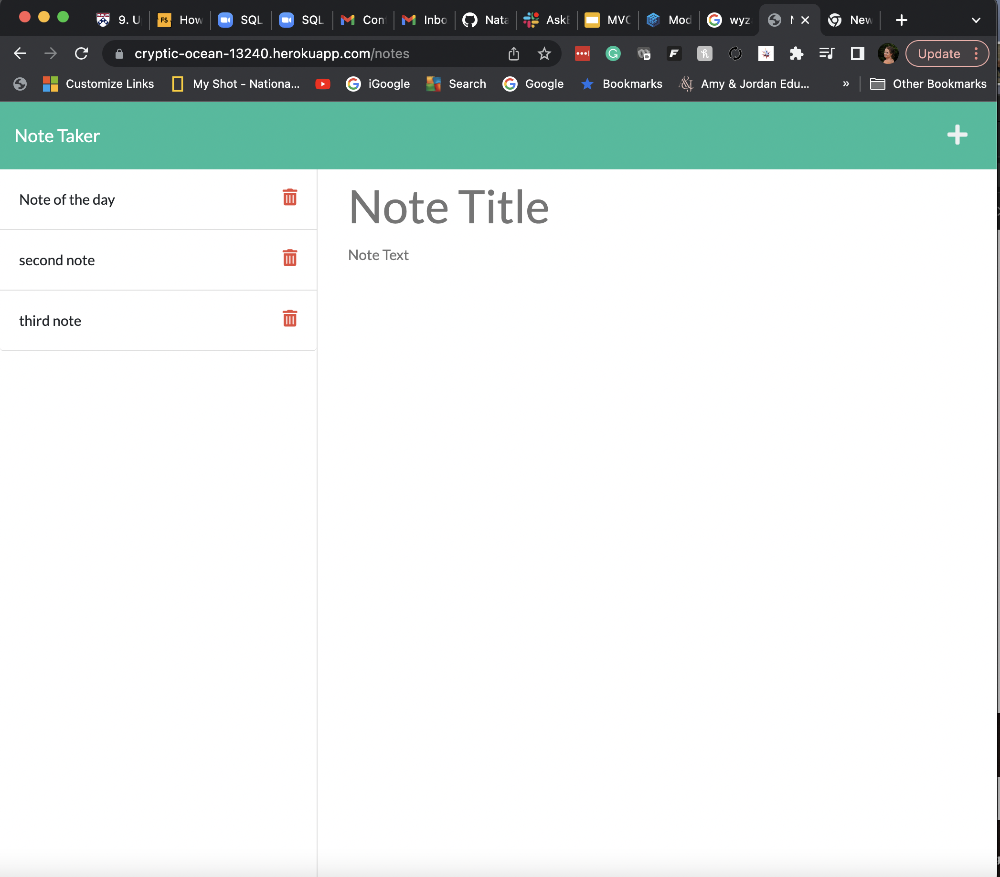

# Note Taker Starter Code

## Goal

Create a program that will help to add and delete notes

## Acceptance Criteria

When i start the page i have option to click on add notes. once I click on it, i have a page with saved notes on the left and a field to add new note on the rigth. Once I enter the note, i have option to save it using icon "save". once the note is saved - it will appear on left side. 
if i need to retrive saved notes - i click on appropriate note on teh left and it will show the content on the rigth field. 

## Mock-up

   https://cryptic-ocean-13240.herokuapp.com/

   

## Credits

class instructor
Sean New
Ask BCS Learning assistant

## License

MIT license

